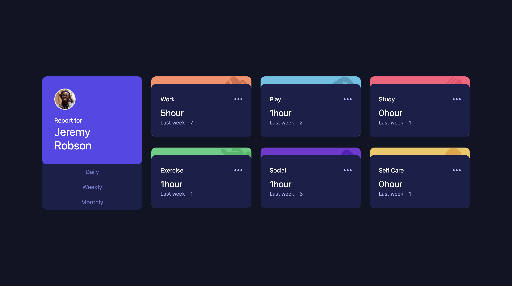

# Frontend Mentor - Time tracking dashboard solution

This is a solution to the [Time tracking dashboard challenge on Frontend Mentor](https://www.frontendmentor.io/challenges/time-tracking-dashboard-UIQ7167Jw). Frontend Mentor challenges help you improve your coding skills by building realistic projects. 

## Table of contents

- [Overview](#overview)
  - [The challenge](#the-challenge)
  - [Screenshot](#screenshot)
  - [Links](#links)
- [My process](#my-process)
  - [Built with](#built-with)
  - [What I learned](#what-i-learned)
  - [Useful resources](#useful-resources)
- [Author](#author)

## Overview

### The challenge

Users should be able to:

- View the optimal layout for the site depending on their device's screen size
- See hover states for all interactive elements on the page
- Switch between viewing Daily, Weekly, and Monthly stats

### Screenshot

### Links

- Solution URL: 
- Live Site URL: 

## My process

### Built with

- TailwindCSS
- Javascript
- Mobile-first workflow

### What I learned

I've learned about displaying data from JSON file depending on the option selected. 

### Useful resources

- [Fetch data from local JSON](https://medium.com/@akshaykrdas001/how-to-fetch-data-from-local-json-file-and-render-it-to-html-document-with-using-vanilla-javascript-a0191a894f25) - Helps me with understand to read local JSON and display using vanilla javascript

## Author

- Github - [Iyra](https://github.com/iyraa)
- Frontend Mentor - [@iyraa](https://www.frontendmentor.io/profile/iyraa)

